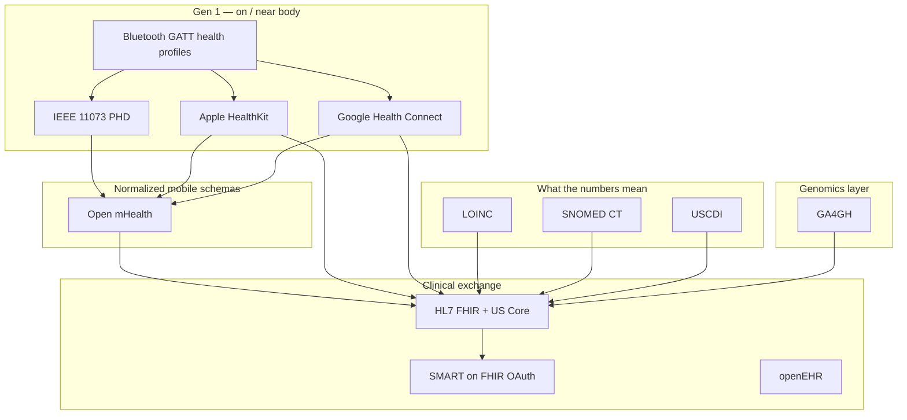

# IoB data standards — what actually moves body data

Standards are the plumbing of the Internet of the Body: without them, every wearable is a private dialect. Layers stack from **radio → device model → phone store → clinical exchange → vocabulary**.

---

## 1. Clinical exchange — HL7 FHIR

**[HL7 FHIR](https://www.hl7.org/fhir/)** is the dominant API-shaped standard for health data. Resources that matter most for IoB:

| FHIR resource | Typical IoB use |
| --- | --- |
| **Observation** | Heart rate, SpO2, BP, glucose, sleep stages, HRV, steps, temperature |
| **Device** | The watch, CGM, patch, scale, implant |
| **Patient / Person** | Who the body belongs to |
| **QuestionnaireResponse** | Symptom / mood / PROMs (subjective body data) |
| **DiagnosticReport** | Labs, omics reports, multi-signal summaries |
| **MedicationRequest / Statement** | Meds that interact with CGM / pump data |
| **DocumentReference** | Exports, PDFs, vendor archives |

**Why it matters for IoB:** Aggregators (Terra, Vital, Spike, etc.) and digital-health platforms increasingly **map wearable streams → FHIR Observations** so the same HR sample can land in a wellness app *and* a care pathway.

**US stack (regulation-backed):**
- **[USCDI](https://www.healthit.gov/isp/united-states-core-data-interoperability-uscdi)** — *which* data classes must be shareable (vitals: HR, BP, SpO2, weight, height, temp, etc.)
- **[US Core FHIR profiles](https://hl7.org/fhir/us/core/)** — *how* those classes look as FHIR (e.g. US Core Heart Rate, Pulse Oximetry)
- **CMS Patient Access API** — payers must expose claims + clinical data via **FHIR R4** so third-party apps can pull member data with consent ([CMS FAQs](https://www.cms.gov/priorities/burden-reduction/overview/interoperability/frequently-asked-questions/patient-access-api))

**Practical note:** Continuous wearable streams (1 Hz PPG, full sleep hypnograms) don’t always fit cleanly into clinical Observation workflows — many systems **summarize** (daily resting HR, nightly SpO2 min) before FHIR-izing.

---

## 2. App launch & consent — SMART on FHIR

**[SMART on FHIR](https://docs.smarthealthit.org/)** is OAuth 2.0 + OpenID Connect for health apps. Pattern:

1. User picks an app  
2. SMART authorization at the EHR/payer  
3. App receives scoped access tokens  
4. App reads FHIR resources (Observations, etc.)

For IoB product design: SMART is how a **third-party body-data app** legally and technically attaches to clinical systems without custom SSO per hospital. Pair with FHIR; they are rarely useful alone.

---

## 3. On-device hubs — HealthKit & Health Connect

These are not open standards in the HL7 sense, but they are the **de-facto consumer IoB buses**.

| | **Apple HealthKit** | **Google Health Connect** |
| --- | --- | --- |
| Where data lives | On-device (iPhone) | On-device (Android) |
| Server API | None (you need a companion app) | None |
| Consent | Per data type | Per data type |
| Clinical angle | Strong Health Records / clinical imports | Growing **FHIR medical records** support |
| Schema style | `HKQuantityType` / category samples | Typed records (e.g. `SleepSessionRecord`) |

**IoB implication:** Most “one integration for all wearables” products either:
- go through **HealthKit / Health Connect** (user’s phone as hub), or  
- go through **vendor OAuth APIs** (Oura, WHOOP, Garmin, Dexcom…), or  
- do both and normalize (Terra/Vital/Spike model).

Schema friction is real: sleep stages, HRV definitions, and calorie models **differ by platform** and need an explicit mapping layer ([comparison writeup](https://sahha.ai/blog/healthkit-vs-health-connect/)).

---

## 4. Mobile-health schemas — Open mHealth

**[Open mHealth](https://www.openmhealth.org/)** defines **JSON schemas** for mobile/wearable signals (heart rate, BP, steps, sleep, glucose, etc.) independent of any one phone OS or EHR.

- Designed for **patient-generated health data (PGHD)**
- Maps cleanly toward FHIR/LOINC in clinical pipelines
- Useful when you want a **vendor-neutral intermediate** between “raw Fitbit JSON” and “FHIR Observation”

Think of Open mHealth as a **normalization layer** for gen-1 consumer signals before clinical packaging.

---

## 5. Device wire formats — IEEE 11073 & Bluetooth GATT

### IEEE 11073 Personal Health Devices (PHD)

**[IEEE 11073](https://sagroups.ieee.org/11073/phd-wg/)** standardizes how personal devices talk (scales, BP cuffs, glucose meters, thermometers, **CGMs** — e.g. 11073-10425 for CGM).

- Strong in **regulated / medical-device** contexts  
- Device specializations define metrics, units, timestamps  
- Often paired with a **manager** (phone, hub, gateway)

### Bluetooth SIG GATT health profiles

BLE services your band actually implements:

- Heart Rate Service  
- Blood Pressure  
- Glucose  
- Pulse Oximeter  
- Continuous Glucose Monitoring  
- Health Thermometer  
- Battery, Device Information, etc.

Bluetooth published **transcoding guidance**: GATT characteristics → IEEE 11073-20601 attributes so a BLE cuff can look like a proper PHD in a clinical stack ([Bluetooth PHD transcoding whitepaper](https://www.bluetooth.com/wp-content/uploads/2019/03/PHD_Transcoding_WP_v16.pdf)).

**IoB generation map:**
- Gen 1 rings/watches → mostly **GATT + proprietary SDKs**  
- Gen 2 CGMs/pumps → **GATT + 11073 + vendor clouds**  
- Clinical RPM kits → often **11073 / cellular hubs**, not consumer BLE apps

---

## 6. Vocabulary — LOINC, SNOMED, UCUM

FHIR says *how to package* a measurement; vocabularies say *what it is*.

| Standard | Role in IoB |
| --- | --- |
| **[LOINC](https://loinc.org/)** | Codes for observations (e.g. heart rate, SpO2, many lab analytes; HRV-related codes exist e.g. RR-interval SD) |
| **SNOMED CT** | Clinical concepts (conditions, body sites, procedures) |
| **UCUM** | Units (`mm[Hg]`, `kg`, `%`, `ms`, `mmol/L`) |

Without LOINC/UCUM, two “heart rate” streams from Oura and a hospital monitor may never merge safely. Wearable → FHIR pipelines almost always assign **LOINC + unit** on the Observation.

---

## 7. Record architecture — openEHR

**[openEHR](https://www.openehr.org/)** is less “REST API resource” and more **long-lived clinical information models** (archetypes/templates). Stronger in some EU / research EHR deployments than in US consumer wearables.

For IoB: useful when body data must live for decades with versioned models (implants, chronic disease), not just daily dashboard JSON.

---

## 8. Genomics layer — GA4GH

**[GA4GH](https://www.ga4gh.org/)** standards (APIs, security, data models) for **genomic and related -omics** sharing. Complements FHIR rather than replacing it:

- Genotype/phenotype → often **snapshot** cadence (sequencing events)  
- FHIR may carry report wrappers; GA4GH handles large genomic payloads and research exchange  

In your awesome-list terms: openSNP, 23andMe exports, clinical panels sit here; continuous CGM/HR sit elsewhere.

---

## 9. How standards map to a real signal

Example: **nightly SpO2 from a smart ring**

| Layer | What happens |
| --- | --- |
| Sensor / BLE | Proprietary PPG or GATT pulse-ox profile |
| Phone hub | HealthKit `oxygenSaturation` / Health Connect SpO2 record |
| Optional normalize | Open mHealth blood-oxygen schema |
| Clinical | FHIR `Observation` + LOINC pulse oximetry + UCUM `%` + US Core Pulse Oximetry profile |
| Access | SMART app or Patient Access API (if clinical system holds it) |

Same pattern for HR, BP, glucose, weight — different LOINC codes and device specializations.

---

## 10. What’s *not* standardized (IoB pain points)

These break “one schema for every body”:

- **HRV** algorithms (RMSSD vs SDNN vs vendor “readiness”)  
- **Sleep staging** labels across Oura / WHOOP / Apple / Garmin  
- **Calories / strain / recovery scores** — almost always proprietary  
- **Raw PPG / IMU waveforms** — rarely exportable; locked in vendor research programs  
- **Gen-3 BCI streams** — mostly vendor SDKs (OpenBCI is the open exception)

Standards cover **vital signs and clinical documents** well; they cover **consumer wellness scores** poorly — which is why aggregator APIs invent their own normalized models on top.

---

## 11. Which standard to use when

| Goal | Prefer |
| --- | --- |
| Ship a consumer health app on iOS/Android | HealthKit + Health Connect |
| Talk to many wearables without N SDKs | Aggregator API *or* HealthKit/Health Connect + optional Open mHealth |
| Plug into hospital / payer data | FHIR R4 + SMART + US Core / USCDI |
| Medical-grade device interoperability | IEEE 11073 + BLE GATT |
| Self-research / open quantified self | Open mHealth, Open Humans exports, open APIs |
| Genomics | GA4GH (+ FHIR for clinical packaging) |
| Decades-long clinical record models | openEHR (region-dependent) |

---

## 12. Tie-back to your list

In [awesome-internet-of-the-body](https://github.com/murffious/awesome-internet-of-the-body), the **Health-data standards and SDKs** section is the thin middle of a thicker stack:

- **Entry points for developers:** HealthKit, Health Connect, FHIR, SMART, Open mHealth  
- **Device layer:** Bluetooth profiles, 11073 (often invisible behind vendor SDKs)  
- **Policy layer:** USCDI + CMS Patient Access (forces clinical data *out* to apps)  
- **Still proprietary:** most ring/watch scores and BCI streams  

If you want to go deeper next, good follow-ups:
1. **Wearable → FHIR Observation mapping** (LOINC tables for HR, SpO2, glucose, sleep)  
2. **SMART scopes & consent UX** for body data apps  
3. **Expanding the repo’s standards section** with IEEE 11073, LOINC, USCDI, BLE profiles as first-class entries  

Say which of those you want expanded (or pushed into the GitHub list once write access is reconnected).
