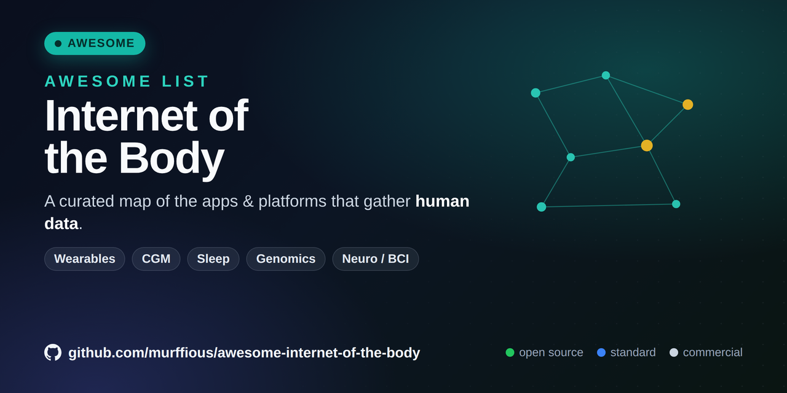

# Awesome Internet of the Body 

  

> About: A curated catalog of wearable sensors, implants, health-data APIs, and open-source tools for the Internet of the Body (IoB): devices and platforms that measure people and move biometric data across apps, clouds, and networks.
>
> Topics: `internet-of-the-body`, `iob`, `wearables`, `biosensors`, `digital-health`, `health-data`, `quantified-self`, `open-source`, `neurotechnology`, `medical-devices`, `health-api`, `personal-data`

> A curated list of apps, platforms, devices, and open-source projects that gather human data — the "Internet of the Body" (IoB).

The Internet of the Body (or Internet of Bodies, IoB) — a term coined by Andrea M. Matwyshyn in 2016 — describes "a network of human bodies whose integrity and functionality rely at least in part on the internet and related technologies." In plain terms: the growing web of wearables, implants, sensors, and apps that measure a human being and move that data across a network.

This list catalogs the software and hardware that does the measuring, with a bias toward open-source and standards-based projects you can actually inspect. The core idea: each entry is a place you can consume human data via app integrations — an API, SDK, webhook, or open export — rather than re-instrument the body yourself. Wherever an entry exposes one, its integration surface is linked.

> This is a reference index, not medical advice and not an endorsement. Every device here collects sensitive personal data — read the Privacy, ethics and data ownership section before you trust any of them.
>
> Legend — openness: 🟢 open source, 🔵 open standard / SDK, ⚪ commercial / proprietary. Cadence (how you consume it): `live` real-time / streaming / webhook, `snapshot` point-in-time or one-time export, `live + history` a live-ish feed plus a historical archive. Standards, SDKs, and tooling carry either mode, so they are left untagged.
>
> **247 entries** across 36 categories (excludes Related projects).

## Contents

- [What counts as the Internet of the Body](#what-counts-as-the-internet-of-the-body)
- [Wearables and rings](#wearables-and-rings)
- [Aggregator and integration APIs](#aggregator-and-integration-apis)
- [Continuous glucose and metabolic](#continuous-glucose-and-metabolic)
- [Sleep and recovery](#sleep-and-recovery)
- [Open-source health-data tooling](#open-source-health-data-tooling)
- [Personal data platforms and Quantified Self](#personal-data-platforms-and-quantified-self)
- [Health-data standards and SDKs](#health-data-standards-and-sdks)
- [Genomics, microbiome and omics](#genomics-microbiome-and-omics)
- [Neuro, brain-computer and implantables](#neuro-brain-computer-and-implantables)
- [Nutrition and food logging](#nutrition-and-food-logging)
- [Cardiac and ECG patches](#cardiac-and-ecg-patches)
- [Continuous blood pressure and cardiovascular wearables](#continuous-blood-pressure-and-cardiovascular-wearables)
- [Hospital-grade remote patient monitoring](#hospital-grade-remote-patient-monitoring)
- [Biosensing textiles and smart garments](#biosensing-textiles-and-smart-garments)
- [Sweat, hydration and electrolyte sensors](#sweat-hydration-and-electrolyte-sensors)
- [Baby, infant and maternal monitoring](#baby-infant-and-maternal-monitoring)
- [Neuromodulation and stimulation wearables](#neuromodulation-and-stimulation-wearables)
- [Hearables and in-ear biosensing](#hearables-and-in-ear-biosensing)
- [Smart contact lenses and ocular biosensing](#smart-contact-lenses-and-ocular-biosensing)
- [Digital stethoscopes and point-of-care imaging](#digital-stethoscopes-and-point-of-care-imaging)
- [Wearable defibrillators](#wearable-defibrillators)
- [Exoskeletons and powered orthotics](#exoskeletons-and-powered-orthotics)
- [Smart prosthetics](#smart-prosthetics)
- [Implantable cardiac monitors and devices](#implantable-cardiac-monitors-and-devices)
- [Implantable neurostimulators and DBS](#implantable-neurostimulators-and-dbs)
- [Brain-computer interfaces (implantable)](#brain-computer-interfaces-implantable)
- [Insulin pumps and closed-loop systems](#insulin-pumps-and-closed-loop-systems)
- [Ingestibles and smart pills](#ingestibles-and-smart-pills)
- [Implantable biosensors](#implantable-biosensors)
- [Smart orthopedic implants](#smart-orthopedic-implants)
- [Bioelectronic medicine](#bioelectronic-medicine)
- [Implantable RFID, NFC and biohacking](#implantable-rfid-nfc-and-biohacking)
- [Smart oral, dental and pelvic health](#smart-oral-dental-and-pelvic-health)
- [Temperature and fertility wearables](#temperature-and-fertility-wearables)
- [Regulatory and policy](#regulatory-and-policy)
- [Security and privacy research](#security-and-privacy-research)
- [Datasets and open-source resources](#datasets-and-open-source-resources)
- [Privacy, ethics and data ownership](#privacy-ethics-and-data-ownership)
- [Newsletters](#newsletters)
- [Related projects](#related-projects)

## What counts as the Internet of the Body

Matwyshyn describes three generations, a useful mental map. Generation 1 (external) devices are worn on the body — smartwatches, rings, chest straps, smart glasses. Generation 2 (internal) devices sit inside it — pacemakers, cochlear implants, digital pills, insulin pumps. Generation 3 (melded) devices merge with the body while staying online — experimental brain-computer interfaces and smart prosthetics wired to nerves.

An entry belongs on this list if it measures a human (physiology, biometrics, behavior, or -omics) and moves that data somewhere — an app, a cloud, or your own server.

## Wearables and rings

External, first-generation devices — the largest source of everyday human data.

- ⚪ [Apple Health / HealthKit](https://developer.apple.com/documentation/healthkit) — on-device store aggregating heart rate, activity, ECG, and dozens of other types; the de-facto hub on iOS. `live + history`
- 🔵 [Health Connect (Android)](https://developer.android.com/health-and-fitness/guides/health-connect) — Google's on-device API that lets fitness and health apps share data with user consent, with [sample apps](https://github.com/android/health-samples). `live + history`
- ⚪ [Oura Ring](https://ouraring.com/) — sleep, HRV, temperature, and readiness, with a [developer API](https://cloud.ouraring.com/docs/). `live + history`
- ⚪ [WHOOP](https://www.whoop.com/) — strain and recovery band with a [public API](https://developer.whoop.com/). `live + history`
- ⚪ [Garmin](https://www.garmin.com/) — GPS and physiology across watches, with a [Health API](https://developer.garmin.com/gc-developer-program/health-api/) for research. `live + history`
- ⚪ [Fitbit](https://www.fitbit.com/) — steps, heart rate, and sleep, with a [Web API](https://dev.fitbit.com/build/reference/web-api/). `live + history`
- ⚪ [Withings](https://www.withings.com/) — scales, blood-pressure cuffs, and sleep mats, with a [developer API](https://developer.withings.com/). `live + history`
- ⚪ [Biostrap](https://biostrap.com/) — research-grade PPG wearable (wrist and shoe pod) with raw waveform access and a developer API. `live + history`
- ⚪ [Sennheiser Momentum Sport](https://www.sennheiser-hearing.com/) — biometric earbuds (hearables) for athletes tracking heart rate via PPG and body temperature via a thermal sensor. `live`
- ⚪ [Google Pixel Watch](https://store.google.com/category/watches) — Wear OS smartwatch with multi-modal biosensing (heart rate, ECG, sleep architecture, activity) integrated via Health Connect and the Fitbit API. `live + history`
- 🟢 [Gadgetbridge](https://github.com/Freeyourgadget/Gadgetbridge) — Android app that talks to many fitness bands and watches without the vendor cloud, keeping data local. A cornerstone open-source IoB project. `live + history`
- ⚪ [Samsung Galaxy Ring](https://www.samsung.com/us/rings/galaxy-ring/) — Smart ring tracking sleep, heart rate, and cycle, integrated with Samsung Health. `live + history`
- ⚪ [Ultrahuman Ring Air](https://www.ultrahuman.com/ring/) — Subscription-free smart ring for sleep, HRV, and metabolic/circadian insights, with a developer API. `live + history`
- ⚪ [RingConn](https://www.ringconn.com/) — Subscription-free smart ring tracking sleep, HRV, SpO2, and stress with multi-day battery. `live + history`
- ⚪ [Movano Evie Ring](https://www.eviering.com/) — Smart ring designed for women's health, cycle, and cardiovascular metrics. `live + history`
- ⚪ [Circular Ring](https://circular.xyz/) — Smart ring with AI coaching for sleep, recovery, and activity. `live + history`
- ⚪ [Amazfit](https://www.amazfit.com/) — Smartwatches and the Helio smart ring with SpO2, HRV, and sleep tracking, feeding the Zepp app. `live + history`
- ⚪ [Polar](https://www.polar.com/en/developers) — Sports watches and heart-rate straps with the AccessLink developer API. `live + history`
- ⚪ [Suunto](https://www.suunto.com/) — GPS multisport watches with heart-rate and recovery tracking. `live + history`
- ⚪ [COROS](https://www.coros.com/) — Endurance sports watches tracking HR, SpO2, and training load. `live + history`
- ⚪ [Masimo W1](https://www.masimopersonalhealth.com/) — Medical-grade wrist wearable providing continuous SpO2, pulse rate, and hydration index. `live`

## Aggregator and integration APIs

The purest expression of "consume human data via app integrations" — one integration that normalizes many devices into a single schema.

- ⚪ [Terra](https://tryterra.co/) — unified API for wearables and health data, connecting dozens of devices and apps through one integration. `live + history`
- ⚪ [Vital](https://tryvital.io/) — API for wearable and lab data with webhooks and normalized schemas. `live + history`
- ⚪ [Spike](https://spikeapi.com/) — health-data API aggregating wearables and medical devices into one endpoint. `live + history`
- ⚪ [Rook](https://www.tryrook.io/) — health-data API unifying wearables and sensors into a single normalized model. `live + history`
- ⚪ [Validic](https://validic.com/) — enterprise platform connecting clinical programs to consumer health devices and apps. `live + history`
- ⚪ [Thryve](https://thryve.health/) — Unified wearable and health-data API aggregating 500+ wearable devices and health apps through one integration, reaching over 50 million end-users via partners. `live + history`
- ⚪ [Human API](https://www.humanapi.co/) — Health-data aggregation platform connecting consumer devices and clinical records (acquired by LexisNexis Risk Solutions). `live + history`
- ⚪ [Sahha](https://sahha.ai/) — Behavioral and health-data API turning wearable signals into mental-health scores. `live + history`

## Continuous glucose and metabolic

Second-generation sensors that read the body's chemistry in near-real time.

- ⚪ [Dexcom G7](https://www.dexcom.com/) — prescription CGM (FDA cleared) for individuals 2+; 10-day wear, 8.2% MARD, 5-min readings, predictive hypoglycemia alerts, insulin-pump integration. `live`
- ⚪ [Dexcom Stelo](https://www.stelo.com/) — OTC CGM (FDA cleared) for adults 18+ (wellness, prediabetes, non-insulin Type 2); 15-day wear, 8.3% MARD, 15-min readings. `live`
- ⚪ [Abbott FreeStyle Libre 3 Plus](https://www.freestyle.abbott/) — prescription CGM (FDA cleared) for individuals 2+; 15-day wear, 8.2% MARD, 1-min readings, pump integration, penny-sized sensor. `live`
- ⚪ [Abbott Lingo](https://www.hellolingo.com/) — OTC CGM (FDA cleared) for adults 18+ focused on general wellness and diet/exercise biofeedback; 14-day wear, 1-min readings, Withings integration. `live`
- ⚪ [Abbott Libre Rio](https://www.abbott.com/en-us/products-solutions/biowearables) — OTC CGM (FDA cleared) for non-insulin-dependent Type 2 adults; 15-day wear (pending launch). `live`
- ⚪ [Medtronic MiniMed Instinct](https://www.medtronicdiabetes.com/) — CGM (FDA cleared) for automated insulin delivery users, manufactured by Abbott; 15-day wear, no calibration required. `live`
- ⚪ [Medtronic MiniMed Simplera Sync](https://www.minimed.com/) — CGM (FDA cleared) for individuals 7+; 6-day wear, fully disposable with no overtape, SmartGuard prediction, 5-min readings. `live`
- ⚪ [Levels](https://www.levelshealth.com/) — metabolic-health app built on top of CGM hardware. `live + history`
- ⚪ [Nutrisense](https://www.nutrisense.io/) — CGM-based metabolic tracking with dietitian support. `live + history`
- 🟢 [Nightscout](https://github.com/nightscout/cgm-remote-monitor) — the "#WeAreNotWaiting" project: a self-hosted CGM data platform where you own the server and the data. `live`
- 🟢 [OpenAPS](https://github.com/openaps) — open-source "artificial pancreas" reference design that closes the loop between CGM and insulin pump. `live`
- 🟢 [Loop](https://github.com/LoopKit/Loop) — open-source automated insulin-delivery app for iOS built on the same idea. `live`
- ⚪ [Lura Health](https://lurahealth.com/) — Continuous Salivary Monitoring (CSM) sensor embedded in a tooth-mounted device that tracks biomarkers in saliva for non-invasive, preventative health management. `live`
- ⚪ [Medtronic Guardian](https://www.medtronic.com/) — Continuous glucose monitor that pairs with MiniMed pumps. `live`
- ⚪ [Signos](https://www.signos.com/) — CGM-driven weight-management app with real-time glucose response. `live + history`
- ⚪ [Sibionics](https://www.sibionics.com/) — CGM system offering continuous glucose data via a mobile app. `live`
- ⚪ [Supersapiens](https://www.supersapiens.com/) — Athlete-focused glucose-monitoring platform built on Abbott sensors. `live`

## Sleep and recovery

- ⚪ [Eight Sleep](https://www.eightsleep.com/) — sensor mattress cover tracking temperature, heart rate, and HRV. `live + history`
- ⚪ [Happy Sleep](https://www.happysleep.com/) — smart ring platform for multi-night at-home sleep apnea testing and virtual care. `live + history`
- ⚪ [Sleep as Android](https://sleep.urbandroid.org/) — sleep tracking that integrates with many wearables. `live + history`
- ⚪ [Withings Sleep](https://www.withings.com/us/en/sleep) — Under-mattress pad tracking sleep cycles, heart rate, and snoring, with a developer API. `live + history`
- ⚪ [Somnofy](https://somnofy.com/) — Contactless radar sleep monitor for clinical and consumer use. `live + history`
- ⚪ [Elemind](https://www.elemind.com/) — EEG headband that uses neurostimulation to speed sleep onset. `live`
- ⚪ [Sleepiz](https://www.sleepiz.com/) — Contactless radar device measuring respiration and heart rate during sleep. `live + history`
- ⚪ [Beddit](https://www.apple.com/) — Under-sheet sleep-tracking strip (Apple), measuring HR and breathing. `live + history`

Oura, WHOOP, and Withings (above) all double as sleep trackers.

## Open-source health-data tooling

Projects you can read, run, and self-host. Nightscout and Gadgetbridge (above) also belong here.

- 🟢 [Home Assistant](https://github.com/home-assistant/core) — local-first automation platform with many health and wearable integrations; a common place people pool body data at home. `live`
- 🟢 [Open mHealth](https://github.com/openmhealth) — open schemas and libraries that normalize mobile health data across sources.
- 🟢 [ResearchKit](https://github.com/ResearchKit/ResearchKit) — Apple's open framework for building medical-research apps that collect participant data.
- 🟢 [CareKit](https://github.com/carekit-apple/CareKit) — Apple's open framework for care and symptom-tracking apps.
- 🟢 [Fit REST API samples](https://github.com/googlearchive/fit-samples) — reference code for reading Google fitness data.

## Personal data platforms and Quantified Self

Platforms whose whole purpose is aggregating your body data — for yourself or for research.

- 🟢 [Open Humans](https://github.com/OpenHumans) — nonprofit platform ([openhumans.org](https://www.openhumans.org/)) to aggregate personal data (wearables, genomes, microbiome) and optionally donate it to research. The most IoB-native open project here. `snapshot`
- ⚪ [Exist.io](https://exist.io/) — correlates data from many trackers to surface patterns. `live + history`
- 🟢 [Quantified Self](https://quantifiedself.com/) — the movement that named "self-knowledge through numbers"; see the community's [tools directory](https://quantifiedself.com/tools/).

## Health-data standards and SDKs

The plumbing that lets body data move between systems — what makes IoB an internet.

- 🔵 [HL7 FHIR](https://github.com/HL7/fhir) — the dominant open standard for exchanging clinical and health data.
- 🔵 [Open mHealth schemas](https://www.openmhealth.org/documentation/) — normalized JSON schemas for mobile health signals.
- 🔵 [SMART on FHIR](https://github.com/smart-on-fhir) — apps that plug into electronic health records.

Apple HealthKit and Google Health Connect (both above) are the two dominant on-device SDKs.
- 🔵 [IEEE 802.15.6](https://standards.ieee.org/ieee/802.15.6/5364/) — IEEE standard for wireless body area networks (WBAN), the radio layer of IoB.
- 🔵 [ISO/IEEE 11073 PHD](https://en.wikipedia.org/wiki/ISO/IEEE_11073_Personal_Health_Data_Standards) — Personal Health Device interoperability standards family (scales, BP cuffs, glucose meters, ECG).
- 🔵 [HL7 FHIR Personal Health Device IG](https://hl7.org/fhir/uv/phd/) — Implementation guide mapping IEEE 11073 device data into FHIR.
- 🔵 [IEEE 1752.1](https://standards.ieee.org/ieee/1752.1/6982/) — Open mobile-health data standard for sleep and physical-activity measures.
- 🔵 [Continua Design Guidelines / PCHAlliance](https://www.pchalliance.org/continua-design-guidelines) — End-to-end interoperability guidelines for personal connected health devices.
- 🔵 [IHE Personal Connected Health](https://wiki.ihe.net/index.php/Personal_Connected_Health) — IHE profiles extending device interoperability to personal connected health.
- 🔵 [GS1 UDI](https://www.gs1.org/industries/healthcare/udi) — Unique Device Identification standards used for global medical-device traceability.
- 🔵 [W3C Web Bluetooth](https://webbluetoothcg.github.io/web-bluetooth/) — Community-group spec for a browser API to talk to BLE health devices (draft, not a ratified standard).
- 🔵 [Bluetooth Heart Rate Service](https://www.bluetooth.com/specifications/specs/heart-rate-service-1-0/) — Official Bluetooth SIG GATT service exposing heart-rate sensor data.
- 🔵 [Samsung Health SDK](https://developer.samsung.com/health) — SDK for reading data from the Samsung Health store.
- ⚪ [Garmin Health API](https://developer.garmin.com/gc-developer-program/health-api/) — API delivering Garmin wearable physiology data for research and enterprise.
- ⚪ [Dexcom API](https://developer.dexcom.com/) — OAuth API for continuous glucose data, events, and alerts.
- ⚪ [Polar AccessLink API](https://www.polar.com/en/developers) — REST API for Polar device training and activity data.
- ⚪ [Google Health API](https://developers.google.com/health) — Google's consolidated health/fitness API (successor to the deprecating Fitbit Web API).

## Genomics, microbiome and omics

Slower-moving but deeply personal body data.

- 🟢 [openSNP](https://github.com/openSNP/snpr) — open database where people share their genotype and phenotype data. `snapshot`
- ⚪ [Nebula Genomics](https://nebula.org/) — whole-genome sequencing with a privacy-forward pitch. `snapshot`
- ⚪ [23andMe](https://www.23andme.com/) — consumer genetics; note its 2023–2025 data-breach and bankruptcy saga, a cautionary IoB privacy case study. `snapshot`
- ⚪ [Viome](https://www.viome.com/) — microbiome and metabolic testing tied to a nutrition app. `snapshot`
- ⚪ [ZOE](https://zoe.com/) — microbiome and blood-fat testing paired with personalized nutrition. `snapshot`

## Neuro, brain-computer and implantables

Third-generation, melded devices — the frontier, and the sharpest ethics.

- 🟢 [OpenBCI](https://github.com/OpenBCI) — open-source hardware and software for EEG, EMG, and ECG biosensing. The accessible on-ramp to neural IoB. `live`
- ⚪ [Atlas](https://atlasmankind.com/) — Behind-the-ear brain wearable combining EEG, electrodermal activity, motion, and voice-pattern sensing to estimate attention and recovery; early preorder stage and iOS-only launch, with no independent validation yet. `snapshot`
- ⚪ [OpenBCI Galea](https://openbci.com/) — mixed-reality biosensing headset integrating EEG, EMG, and ECG with Meta Quest 3 for developer and research use. `live`
- ⚪ [Neuralink](https://neuralink.com/) — implanted brain-computer interface. `live`
- ⚪ [Synchron](https://synchron.com/) — endovascular BCI implanted via blood vessels, with no open-skull surgery. `live`
- ⚪ [Medtronic](https://www.medtronic.com/) — connected pacemakers, insulin pumps, and neurostimulators; a huge share of real-world "generation 2" IoB. `live + history`
- ⚪ [Muse](https://choosemuse.com/) — Consumer EEG headband for meditation and sleep neurofeedback, with an SDK. `live`
- ⚪ [Emotiv](https://www.emotiv.com/) — Research- and consumer-grade multi-channel EEG headsets with a data SDK. `live`
- ⚪ [NeuroSky](https://neurosky.com/) — Low-cost single-channel EEG biosensor and developer toolkit. `live`
- ⚪ [Neurable MW75 Neuro](https://www.neurable.com/) — Over-ear headphones with embedded dry-electrode EEG for focus tracking. `live`
- ⚪ [Neurosity Crown](https://neurosity.co/) — Wearable EEG device with an on-board processor and developer SDK. `live`
- ⚪ [Cognixion](https://www.cognixion.com/) — AR headset combining EEG and eye-tracking for assistive communication. `live`
- ⚪ [Wearable Devices Mudra Band](https://www.wearabledevices.co.il/) — Neural-input wristband reading surface nerve signals for touchless control. `live`
- ⚪ [Pison](https://pison.com/) — EMG/neural wristband sensing electrical nerve signals for gesture control and cognitive metrics. `live`
- ⚪ [Flow Neuroscience](https://www.flowneuroscience.com/) — At-home tDCS headset for depression, CE-marked. `live`
- ⚪ [Neuroelectrics](https://www.neuroelectrics.com/) — Research-grade EEG monitoring and closed-loop neurostimulation platform. `live`

## Nutrition and food logging

Apps that log what goes into the body — the input side of the human-data picture.

- 🟢 [Open Food Facts](https://github.com/openfoodfacts) — open, crowd-sourced database of foods and their labels ([openfoodfacts.org](https://world.openfoodfacts.org/)).
- ⚪ [MealCoach.ai](https://mealcoach.ai/) — treating nutrition like a metabolic credit score. 
- ⚪ [Cronometer](https://cronometer.com/) — micronutrient-accurate food and biometric logging with an [API](https://cronometer.com/api/). `live + history`
- ⚪ [MyFitnessPal](https://www.myfitnesspal.com/) — large-scale food and exercise logging. `live + history`

## Cardiac and ECG patches

Wearable ECG patches and ambulatory cardiac monitors.

- ⚪ [iRhythm Zio](https://www.irhythmtech.com/) — Long-term wearable ECG patch with FDA-cleared AI arrhythmia analysis. FDA-cleared. `snapshot`
- ⚪ [VitalConnect VitalPatch](https://vitalconnect.com/) — FDA-cleared chest biosensor streaming ECG and vitals in real time. `live`
- ⚪ [BardyDx CAM](https://www.baxter.com/) — Carnation ambulatory ECG monitor patch (now Baxter). FDA-cleared. `snapshot`
- ⚪ [Philips ePatch](https://www.philips.com/) — Extended-wear ambulatory ECG patch. FDA-cleared. `snapshot`
- ⚪ [AliveCor KardiaMobile](https://www.kardia.com/) — Personal single- and six-lead ECG that pairs with a phone. FDA-cleared. `live`
- ⚪ [Qardio](https://www.getqardio.com/) — Connected ECG, blood-pressure, and remote-monitoring devices. FDA-cleared. `live + history`
- ⚪ [Preventice BodyGuardian](https://www.boston-scientific-preventice.com/) — Remote cardiac monitoring body sensor (Boston Scientific). FDA-cleared. `live`

## Continuous blood pressure and cardiovascular wearables

Cuffless and wrist-based continuous blood-pressure devices.

- ⚪ [Aktiia / Hilo](https://hilo.com/) — Cuffless optical wrist band for continuous blood pressure; first FDA-cleared OTC cuffless BP monitor. `live + history`
- ⚪ [Omron HeartGuide](https://omronhealthcare.com/) — Oscillometric blood-pressure smartwatch. FDA-cleared. `live + history`
- ⚪ [Biobeat](https://www.bio-beat.com/) — Cuffless BP and vitals monitoring via chest patch and wrist device. FDA-cleared. `live`
- ⚪ [CardieX](https://www.cardiex.com/) — Arterial-health and blood-pressure wearable technology. `live + history`

## Hospital-grade remote patient monitoring

FDA-cleared continuous biosensors designed for clinical and home-hospital programs.

- ⚪ [BioIntelliSense BioButton](https://www.biointellisense.com/) — FDA-cleared coin-sized patch capturing 20+ vital signs continuously. `live`
- ⚪ [Current Health](https://currenthealth.com/) — FDA-cleared upper-arm wearable and home platform for continuous RPM (Best Buy Health). `live`
- ⚪ [Vivalink](https://www.vivalink.com/) — Medical-grade reusable ECG, temperature, and vitals patches with data APIs. `live`
- ⚪ [Biofourmis](https://www.biofourmis.com/) — Wearable-plus-AI platform for remote patient monitoring and virtual care. `live + history`
- ⚪ [Isansys Patient Status Engine](https://www.isansys.com/) — Wireless multi-parameter patient monitoring platform. `live`
- ⚪ [LifeSignals](https://lifesignals.com/) — Wireless biosensor patches for hospital and remote ECG/vitals monitoring. `live`
- ⚪ [Sibel Health ANNE](https://www.sibelhealth.com/) — Wireless dual-sensor system for continuous vitals across care settings. `live`

## Biosensing textiles and smart garments

E-textile platforms that weave physiological sensors directly into clothing.

- ⚪ [Hexoskin](https://www.hexoskin.com/) — Clinically validated smart shirts recording ECG, respiration, and activity, with data APIs. `live + history`
- ⚪ [Myant SKIIN](https://www.skiin.com/) — Textile-computing underwear and garments capturing ECG and vitals. `live + history`
- ⚪ [Sensoria](https://www.sensoriafitness.com/) — Smart socks and garments with pressure/gait sensors and a developer API. `live + history`
- ⚪ [Nanowear SimpleSense](https://www.nanowearinc.com/) — FDA-cleared cloth-based nanosensor vest for cardiac and hemodynamic monitoring. `live`
- ⚪ [Siren](https://siren.care/) — Smart socks with embedded temperature sensors for diabetic foot monitoring. FDA-registered. `live`
- ⚪ [Nadi X](https://www.wearablex.com/) — Sensor-embedded yoga pants giving haptic posture feedback. `live`

## Sweat, hydration and electrolyte sensors

Microfluidic and patch-based sensors that analyze sweat biomarkers in real time.

- ⚪ [Epicore Biosystems](https://www.epicorebiosystems.com/) — Microfluidic sweat patches (incl. Connected Hydration) measuring fluid and electrolyte loss. `live`
- ⚪ [Gatorade Gx Sweat Patch](https://www.gatorade.com/gx/sweat-patch) — Consumer microfluidic sweat patch read via a phone app. `snapshot`
- ⚪ [Nix Biosensors](https://nixbiosensors.com/) — Wearable sweat biosensor delivering real-time hydration analytics. `live`
- ⚪ [hDrop](https://hdrop.com/) — Wearable hydration monitor tracking sweat rate and electrolytes. `live`
- ⚪ [Flowbio](https://www.flowbio.com/) — Continuous sweat-sensing patch for hydration and sodium loss. `live`

## Baby, infant and maternal monitoring

Wearables and sensors specifically designed for infants, neonates, and pregnancy.

- ⚪ [Owlet Dream Sock](https://owletcare.com/) — FDA-cleared infant sock monitoring pulse rate and oxygen. `live`
- ⚪ [Masimo Stork](https://www.masimostork.com/) — FDA-cleared infant monitoring system tracking oxygen, pulse, and skin temperature. `live`
- ⚪ [Nanit](https://www.nanit.com/) — Camera-based baby monitor measuring breathing motion and sleep. `live + history`
- ⚪ [Nuvo INVU](https://nuvocares.com/) — FDA-cleared remote pregnancy sensor band measuring maternal and fetal heart rate. `live`
- ⚪ [Bloomlife](https://bloomlife.com/) — Wearable pregnancy monitor tracking contractions. `live + history`

## Neuromodulation and stimulation wearables

Wearable devices that both sense and deliver therapeutic neural stimulation.

- ⚪ [Cala kIQ](https://calahealth.com/) — FDA-cleared wrist neurostimulation wearable for essential tremor and Parkinson's. `live`
- ⚪ [Theranica Nerivio](https://www.nerivio.com/) — FDA-cleared smartphone-controlled armband delivering remote electrical neuromodulation for migraine. `live`
- ⚪ [Cefaly](https://www.cefaly.com/) — FDA-cleared OTC trigeminal-nerve stimulation headband for migraine. `live`
- ⚪ [electroCore gammaCore](https://www.gammacore.com/) — FDA-cleared handheld non-invasive vagus nerve stimulator. `live`
- ⚪ [Apollo Neuro](https://apolloneuro.com/) — Wrist/ankle wearable delivering vibration for stress and recovery. `live + history`
- ⚪ [Alpha-Stim](https://www.alpha-stim.com/) — FDA-cleared cranial electrotherapy stimulation device for anxiety, insomnia, and pain. `live`

## Hearables and in-ear biosensing

In-ear devices that combine audio with continuous physiological sensing.

- ⚪ [STAT Health](https://www.stat-health.com/) — In-ear wearable measuring blood flow to the head for POTS, long COVID, and ME/CFS. `live + history`
- ⚪ [NextSense](https://nextsense.io/) — EEG-sensing earbuds monitoring brain activity and sleep. `live`

## Smart contact lenses and ocular biosensing

Contact lens and ocular AR platforms embedding biosensors at or near the eye.

- ⚪ [XPANCEO](https://www.xpanceo.com/) — Smart contact-lens prototypes with tear-fluid biosensing and intraocular-pressure sensing. Investigational. `live`
- ⚪ [Sensimed Triggerfish](https://www.sensimed.ch/) — Contact-lens sensor recording intraocular-pressure fluctuations for glaucoma. CE-marked. `snapshot`
- ⚪ [Emteq Labs](https://www.emteqlabs.com/) — Eyewear with facial-EMG and optical sensors for emotion and health sensing. `live`

## Digital stethoscopes and point-of-care imaging

Connected auscultation and handheld ultrasound devices that stream clinical-grade body data.

- ⚪ [Eko Health](https://www.ekohealth.com/) — Digital stethoscopes (CORE 500) with 3-lead ECG and FDA-cleared cardiac AI. `live`
- ⚪ [Butterfly iQ](https://www.butterflynetwork.com/) — Handheld whole-body ultrasound on a single semiconductor chip. FDA-cleared. `live`
- ⚪ [Clarius](https://clarius.com/) — Wireless handheld ultrasound scanners paired with a phone app. FDA-cleared. `live`
- ⚪ [Pulsify Medical](https://www.pulsify-medical.com/) — Wearable ultrasound patch for continuous cardiac monitoring. Investigational. `live`

## Wearable defibrillators

Life-critical wearable devices that detect and treat dangerous arrhythmias automatically.

- ⚪ [ZOLL LifeVest](https://lifevest.zoll.com/) — Wearable cardioverter defibrillator for patients at risk of sudden cardiac arrest. FDA-approved. `live`

## Exoskeletons and powered orthotics

Motor-assisted external frames that augment or restore movement, feeding motion and EMG data.

- ⚪ [Ekso Bionics](https://eksobionics.com/) — Powered exoskeletons for neurological rehabilitation and industrial use. FDA-cleared. `live`
- ⚪ [ReWalk / Lifeward](https://golifeward.com/) — Personal and rehab exoskeletons for spinal-cord-injury mobility. FDA-cleared. `live`
- ⚪ [Wandercraft Atalante](https://en.wandercraft.eu/) — Self-balancing hands-free exoskeleton for gait rehabilitation. FDA-cleared. `live`
- ⚪ [Cyberdyne HAL](https://www.cyberdyne.jp/english/) — Bioelectric-signal-driven wearable exoskeleton (Hybrid Assistive Limb). `live`
- ⚪ [Myomo MyoPro](https://myomo.com/) — Myoelectric arm orthosis reading surface EMG to restore arm function. FDA-registered. `live`
- ⚪ [German Bionic](https://germanbionic.com/) — Connected exoskeletons for industrial lifting and ergonomics. `live`

## Smart prosthetics

Myoelectric and neural-controlled prosthetic limbs that read the body and send back sensory feedback.

- ⚪ [Össur](https://www.ossur.com/) — Bionic limbs (Power Knee, i-Limb) with myoelectric control and sensors. `live`
- ⚪ [Open Bionics Hero Arm](https://openbionics.com/) — Multi-grip myoelectric bionic arm reading muscle signals. CE/FDA-registered. `live`
- ⚪ [PSYONIC Ability Hand](https://www.psyonic.io/) — Touch-sensing bionic hand with an open developer API. `live`
- ⚪ [Coapt](https://coaptengineering.com/) — Pattern-recognition myoelectric control system for prostheses. `live`
- ⚪ [Esper Bionics](https://esperbionics.com/) — Cloud-connected self-learning bionic hand. `live`
- ⚪ [Atom Limbs](https://www.atomlimbs.com/) — Neurally controlled prosthetic arm in development. Investigational. `live`

## Implantable cardiac monitors and devices

Second-generation implants that continuously monitor or actively treat cardiac conditions.

- ⚪ [Medtronic Micra](https://www.medtronic.com/) — Leadless intracardiac pacemaker with remote monitoring. FDA-approved. `live + history`
- ⚪ [Medtronic LINQ II](https://www.medtronic.com/) — Insertable cardiac monitor streaming ECG via Bluetooth for up to 4.5 years. FDA-cleared. `live + history`
- ⚪ [Abbott Aveir](https://www.cardiovascular.abbott/) — Leadless pacemaker with remote follow-up. FDA-approved. `live + history`
- ⚪ [Abbott Assert-IQ](https://www.cardiovascular.abbott/) — Insertable cardiac monitor with up to 6-year battery and AI arrhythmia detection. FDA-cleared. `live + history`
- ⚪ [Boston Scientific LUX-Dx](https://www.bostonscientific.com/) — Insertable cardiac monitor with dual-stage arrhythmia detection. FDA-cleared. `live + history`
- ⚪ [Biotronik BIOMONITOR](https://www.biotronik.com/) — Insertable cardiac monitor with home-monitoring telemetry. FDA-cleared. `live + history`
- ⚪ [Abbott CardioMEMS](https://www.cardiovascular.abbott/) — Implanted pulmonary-artery pressure sensor for heart-failure management. FDA-approved. `live + history`

## Implantable neurostimulators and DBS

Surgically implanted devices that sense neural signals and deliver closed-loop stimulation therapy.

- ⚪ [Medtronic Percept](https://www.medtronic.com/) — Deep-brain-stimulation system with BrainSense neural sensing. FDA-approved. `live + history`
- ⚪ [NeuroPace RNS](https://www.neuropace.com/) — Responsive closed-loop brain stimulator for epilepsy that records EEG. FDA-approved. `live + history`
- ⚪ [Inspire](https://www.inspiresleep.com/) — Implanted hypoglossal-nerve stimulator for obstructive sleep apnea, app-controlled. FDA-approved. `live`
- ⚪ [Nyxoah Genio](https://www.nyxoah.com/) — Bilateral hypoglossal-nerve stimulator for sleep apnea with a wearable activation patch. CE-marked. `live`
- ⚪ [LivaNova VNS](https://www.livanova.com/) — Implanted vagus-nerve stimulator for epilepsy and depression. FDA-approved. `live + history`
- ⚪ [Nevro HFX](https://www.nevro.com/) — Spinal-cord stimulator for chronic pain with cloud-connected app. FDA-approved. `live + history`
- ⚪ [Saluda Evoke](https://www.saludamedical.com/) — Closed-loop spinal-cord stimulator measuring evoked neural responses. FDA-approved. `live + history`
- ⚪ [Axonics](https://www.axonics.com/) — Implantable sacral neuromodulation system for bladder/bowel control. FDA-approved. `live + history`
- ⚪ [Onward ARC](https://onwd.com/) — Spinal-cord stimulation platform for spinal-cord-injury movement restoration. Investigational. `live`

## Brain-computer interfaces (implantable)

Third-generation melded devices that create a direct digital channel into the brain.

- ⚪ [Precision Neuroscience](https://precisionneuro.io/) — Thin-film cortical-surface BCI (Layer 7) with FDA 510(k) clearance for temporary use. Investigational. `live`
- ⚪ [Paradromics](https://www.paradromics.com/) — High-bandwidth intracortical BCI (Connexus) for speech restoration. Investigational. `live`
- ⚪ [Blackrock Neurotech](https://blackrockneurotech.com/) — Utah/NeuroPort-Array BCI platform with 40+ array procedures — the most among research-stage intracortical BCIs. Investigational. `live`
- ⚪ [Science Corporation](https://science.xyz/) — Retinal prosthesis (PRIMA) and BCI developer. Investigational. `live`
- ⚪ [INBRAIN Neuroelectronics](https://www.inbrain-neuroelectronics.com/) — Graphene-based neural interface for neurological disease. Investigational. `live`
- ⚪ [Motif Neurotech](https://www.motifneuro.tech/) — Minimally invasive wireless brain implant for mental health. Investigational. `live`

## Insulin pumps and closed-loop systems

Smart insulin-delivery devices — from connected pumps to fully automated closed-loop ("artificial pancreas") systems.

- ⚪ [Tandem t:slim X2](https://www.tandemdiabetes.com/) — Touchscreen insulin pump with Control-IQ automated delivery. FDA-cleared. `live + history`
- ⚪ [Tandem Mobi](https://www.tandemdiabetes.com/) — Smallest phone-controlled automated insulin-delivery pump. FDA-cleared. `live + history`
- ⚪ [Insulet Omnipod 5](https://www.omnipod.com/) — Tubeless automated insulin-delivery pod driven by CGM data. FDA-cleared. `live + history`
- ⚪ [Medtronic MiniMed 780G](https://www.medtronic.com/) — Advanced hybrid closed-loop insulin pump. FDA-approved. `live + history`
- ⚪ [Beta Bionics iLet](https://www.betabionics.com/) — Bionic pancreas requiring only body weight to start automated dosing. FDA-cleared. `live + history`
- ⚪ [Sequel twiist](https://www.twiist.com/) — Automated insulin-delivery system using an open interoperable algorithm. FDA-cleared. `live + history`
- 🟢 [AndroidAPS](https://github.com/nightscout/AndroidAPS) — Open-source automated insulin-delivery app for Android. `live`
- 🟢 [Trio](https://github.com/nightscout/Trio) — Open-source iOS automated insulin-delivery app based on the OpenAPS algorithm. `live`
- 🟢 [xDrip+](https://github.com/NightscoutFoundation/xDrip) — Open-source Android CGM data hub interoperating with loops and Nightscout. `live`
- 🟢 [Tidepool](https://github.com/tidepool-org) — Open-source diabetes-data platform; Tidepool Loop is an FDA-cleared AID app. `live + history`

## Ingestibles and smart pills

Pill-sized sensors, gas sensors, and drug-delivery capsules swallowed to sense from inside the GI tract.

- ⚪ [Atmo Biosciences](https://www.atmobiosciences.com/) — Ingestible gas-sensing capsule measuring gut gases and transit. Investigational. `snapshot`
- ⚪ [etectRx ID-Cap](https://etectrx.com/) — Ingestible sensor system tracking medication adherence. FDA-cleared. `snapshot`
- ⚪ [Vibrant Gastro](https://www.vibrantgastro.com/) — Drug-free vibrating capsule for chronic constipation. FDA-cleared. `snapshot`
- ⚪ [Medtronic PillCam](https://www.medtronic.com/) — Ingestible capsule-endoscopy camera imaging the GI tract. FDA-cleared. `snapshot`
- ⚪ [CapsoVision CapsoCam](https://www.capsovision.com/) — Panoramic capsule-endoscopy system for small-bowel imaging. FDA-cleared. `snapshot`
- ⚪ [AnX Robotica NaviCam](https://www.anxrobotica.com/) — Magnetically controlled capsule-endoscopy system with AI reading. FDA-cleared. `snapshot`

## Implantable biosensors

Sub-skin chemical sensors offering continuous biochemical monitoring without daily wear.

- ⚪ [Senseonics Eversense 365](https://www.eversensecgm.com/) — Implantable continuous glucose sensor lasting up to one year. FDA-approved. `live`
- ⚪ [Biolinq](https://www.biolinq.com/) — Intradermal microneedle glucose biosensor. Investigational. `live`
- ⚪ [Profusa](https://profusa.com/) — Injectable tissue-integrating biosensors for continuous chemistry monitoring. Investigational. `live`

## Smart orthopedic implants

Instrumented joint replacements that beam gait and load data out through the skin.

- ⚪ [Zimmer Biomet Persona IQ](https://www.zimmerbiomet.com/) — First FDA-authorized smart knee implant with an embedded gait sensor. FDA De Novo. `live + history`
- ⚪ [Canary Medical canturio](https://canarymedical.com/) — Implantable sensor (CHIRP) reporting gait and range-of-motion metrics. FDA De Novo. `live + history`

## Bioelectronic medicine

Implanted devices that treat chronic disease by electrically modulating nerve signals rather than delivering drugs.

- ⚪ [SetPoint Medical](https://setpointmedical.com/) — Implanted vagus-nerve stimulator for autoimmune disease. FDA-approved (rheumatoid arthritis). `live`
- ⚪ [CVRx Barostim](https://www.cvrx.com/) — Implanted baroreflex-activation device for heart failure. FDA-approved. `live + history`

## Implantable RFID, NFC and biohacking

Voluntarily implanted chips for identification, cryptographic identity, and DIY biosensing.

- ⚪ [Dangerous Things](https://dangerousthings.com/) — Consumer implantable RFID/NFC transponders for access and identity. `live`
- ⚪ [VivoKey](https://vivokey.com/) — Cryptographically secure implantable NFC chips with a developer API. `live`
- ⚪ [Walletmor](https://walletmor.com/) — Implantable contactless-payment chip. `live`
- 🟢 [Grindhouse Wetware](https://www.grindhousewetware.com/) — Open-source biohacking implants and augmentation hardware. `live`

## Smart oral, dental and pelvic health

Connected toothbrushes, dental sensors, and pelvic-floor trainers that generate body data.

- ⚪ [Oral-B iO](https://oralb.com/) — Connected electric toothbrush with AI brushing tracking. `live + history`
- ⚪ [Colgate hum](https://www.colgate.com/) — Smart toothbrush tracking brushing coverage via an app. `live + history`
- ⚪ [Elvie](https://www.elvie.com/) — Connected pelvic-floor trainer and breast pump measuring muscle activity. `live + history`
- ⚪ [Perifit](https://perifit.co/) — App-connected pelvic-floor trainer using an intravaginal pressure sensor. `live + history`
- ⚪ [kegg](https://www.kegg.tech/) — Intravaginal fertility sensor measuring cervical-fluid changes. `live + history`
- ⚪ [Daye](https://yourdaye.com/) — Diagnostic tampon for at-home vaginal-microbiome and STI screening. `snapshot`

## Temperature and fertility wearables

Devices that track basal body temperature or hormones to support fertility awareness and cycle monitoring.

- ⚪ [Tempdrop](https://www.tempdrop.com/) — Wearable overnight basal-body-temperature sensor for fertility tracking. `live + history`
- ⚪ [OvuSense](https://www.ovusense.com/) — Continuous core-body-temperature sensor for ovulation tracking. `live + history`
- ⚪ [Femometer](https://www.femometer.com/) — Connected basal thermometer and fertility-tracking ecosystem. `live + history`
- ⚪ [Eli Health](https://www.elihealth.com/) — Noninvasive wearable for continuous hormone tracking (LH, progesterone, estrogen) via saliva. `live + history`

## Regulatory and policy

Official regulatory frameworks and guidance documents that govern connected health devices.

- 🔵 [FDA Digital Health Center of Excellence](https://www.fda.gov/medical-devices/digital-health-center-excellence) — FDA hub coordinating digital-health regulation and best practices.
- 🔵 [FDA Software as a Medical Device (SaMD)](https://www.fda.gov/medical-devices/digital-health-center-excellence/software-medical-device-samd) — FDA's SaMD regulatory framework and guidance.
- 🔵 [FDA Predetermined Change Control Plan](https://www.fda.gov/regulatory-information/search-fda-guidance-documents/marketing-submission-recommendations-predetermined-change-control-plan-artificial-intelligence) — Guidance allowing pre-authorized updates to AI-enabled devices.
- 🔵 [FDA Cybersecurity in Medical Devices](https://www.fda.gov/regulatory-information/search-fda-guidance-documents/cybersecurity-medical-devices-quality-management-system-considerations-and-content-premarket) — Premarket cybersecurity guidance implementing FD&C Act section 524B.
- 🔵 [EU MDR 2017/745](https://eur-lex.europa.eu/legal-content/EN/TXT/PDF/?uri=CELEX:02017R0745-20230320) — EU Medical Device Regulation governing device design and marketing.
- 🔵 [UK MHRA Software and AI as a Medical Device](https://www.gov.uk/government/publications/software-and-ai-as-a-medical-device-change-programme) — MHRA reform programme for regulating SaMD/AIaMD.

## Security and privacy research

Published vulnerability advisories and security research specific to implanted and wearable medical devices.

- ⚪ [Medtronic Conexus advisory (ICSMA-19-080-01)](https://www.cisa.gov/news-events/ics-medical-advisories/icsma-19-080-01) — CISA advisory on unencrypted Medtronic implant telemetry (CVE-2019-6540) spanning ~19 ICD/CRT-D product lines (Amplia, Claria, Evera, Virtuoso, etc.), reported as ~750,000 vulnerable defibrillators.
- ⚪ [St. Jude/Abbott pacemaker advisory (ICSMA-17-241-01)](https://www.cisa.gov/news-events/ics-medical-advisories/icsma-17-241-01) — CISA advisory paired with the FDA's Aug. 2017 firmware corrective action covering 465,000 U.S. (745,000 worldwide) Abbott/St. Jude RF-enabled pacemakers.
- ⚪ [SweynTooth](https://asset-group.github.io/disclosures/sweyntooth/) — Family of Bluetooth Low Energy vulnerabilities affecting medical devices.
- ⚪ [Biohacking Village](https://www.villageb.io/) — DEF CON village running the Medical Device Lab bridging researchers, makers, and FDA.
- ⚪ [Health-ISAC](https://health-isac.org/) — Global health-sector threat-intelligence sharing community.
- ⚪ [I Am The Cavalry](https://iamthecavalry.org/) — Volunteer group focused on cybersecurity where it intersects public safety.
- ⚪ [Wearable Plateau: Why the Next Revolution Won’t Be Another Score](https://www.linkedin.com/pulse/wearable-plateau-why-next-revolution-wont-another-score-hassan-md-q6q4e/) — Analysis of the wearable industry's plateau and its next areas of innovation.

## Datasets and open-source resources

Freely available physiological datasets, open corpora, and software repositories for IoB research.

- 🟢 [PhysioNet](https://physionet.org/) — Repository of freely available physiological-signal databases and software.
- 🟢 [MIMIC-IV Waveform](https://physionet.org/content/mimic4wdb/0.1.0/) — ICU bedside-monitor physiological waveforms linkable to MIMIC-IV clinical data.
- 🟢 [WESAD](https://archive.ics.uci.edu/dataset/465/wesad+wearable+stress+and+affect+detection) — Wearable stress-and-affect dataset from chest and wrist sensors.
- 🟢 [PPG-DaLiA](https://archive.ics.uci.edu/dataset/495/ppg+dalia) — PPG-for-daily-life-activities dataset for heart-rate estimation.
- 🟢 [wearipedia](https://github.com/Stanford-Health/wearipedia) — Python toolkit for extracting and simulating wearable-device data (Stanford Snyder Lab).
- 🟢 [All of Us wearables data](https://support.researchallofus.org/hc/en-us/articles/20281023493908-Resources-for-Using-Fitbit-Data) — NIH program's Fitbit wearables dataset via the Researcher Workbench.
- **Proteus Digital Health** — Digital-pill pioneer (Abilify MyCite); bankrupt 2020, assets sold to Otsuka.
- **Second Sight Argus II** — Retinal implant abandoned, leaving patients unsupported (cautionary case).
- **Thalmic Labs Myo** — EMG gesture armband discontinued 2018.
- **Halo Neuroscience (Halo Sport)** — Neurostimulation headphones; assets acquired 2020.
- **Mojo Vision** — AR/biosensing contact lens; pivoted away from the lens in 2023.
- **Medtronic SmartPill** — Ingestible motility capsule discontinued 2023.
- **Google/Verily glucose contact lens** — Program halted 2018.
- Your existing generic `Medtronic` entry should be split into specific product lines above (Micra, LINQ II, MiniMed 780G, Percept, PillCam) for precision.
- The `awesome-internet-of-the-body-README.md`, `awesome-internet-of-the-body-CONTRIBUTING.md`, and `awesome-internet-of-the-body-files.zip` appear to be leftover duplicates and would fail `awesome-lint`; remove them before submitting to the Awesome index.
- Your existing 23andMe entry is correctly flagged as a cautionary privacy case — keep it.
- A handful of URLs are best-guess official homepages that should be resolve-checked before commit: STAT Health (stat-health.com), Pulsify Medical (pulsify-medical.com), Human API (humanapi.co — acquired by LexisNexis), the ZOLL LifeVest path (lifevest.zoll.com), and the MHRA gov.uk slug. All entities/products are confirmed real and current; only the exact URL paths need a final click-through.
- Several BCI/implant/contact-lens entries are **investigational** (not cleared/approved) — they are flagged as such; keep those flags in the README so the list doesn't overstate availability.
- Regulatory status changes fast; "FDA-cleared/approved/De Novo" reflects reporting as of August 2026 and should be periodically re-verified against the FDA 510(k)/PMA/De Novo databases.
- WESAD and PPG-DaLiA are hosted at multiple mirrors (UCI vs. university pages); the UCI links above are the stable primary sources.
- A few widely used items from your task brief could not be individually re-verified within this research pass and were intentionally omitted rather than listed with unverified links (e.g., some smaller sleep/EEG and sweat-sensor startups); they can be added later after a link check.

## Privacy, ethics and data ownership

Body data is the most sensitive data there is. Any honest IoB list must point here.

- 🟢 [Solid](https://github.com/solid/solid) — Tim Berners-Lee's protocol for personal data "pods" you control ([inrupt.com](https://www.inrupt.com/)).
- ⚪ [MyData Global](https://www.mydata.org/) — nonprofit advancing human-centric personal-data rights.

- ⚪ [RAND — The Internet of Bodies](https://www.rand.org/pubs/research_reports/RR3226.html) — RAND report RR-3226-RC (2020), "The Internet of Bodies: Opportunities, Risks, and Governance," by Mary Lee, Benjamin Boudreaux, Ritika Chaturvedi, Sasha Romanosky, and Bryce Downing.
- ⚪ [Matwyshyn — The Internet of Bodies](https://scholarship.law.wm.edu/wmlr/vol61/iss1/3/) — Andrea M. Matwyshyn, "The Internet of Bodies," 61 Wm. & Mary L. Rev. 77 (2019), which sets out the three generations of IoB: Body External (p.94), Body Internal (p.103), and Body Melded (p.112).
- ⚪ [World Economic Forum — The Internet of Bodies Is Here](https://www.weforum.org/publications/the-internet-of-bodies-is-here-tackling-new-challenges-of-technology-governance/) — WEF report on IoB governance challenges.

Further reading: the [Purdue Center for the Internet of Bodies](https://engineering.purdue.edu/C-IoB) and the [RAND report on the Internet of Bodies](https://www.rand.org/pubs/research_reports/RR3226.html). And questions worth asking of any entry above: where does the data live, can you export or delete it, who can it be sold or subpoenaed to, and what happens to it if the company folds? (The 23andMe collapse is the canonical worked example.)

## Newsletters

- [Wearable Healthcare AI](https://www.linkedin.com/newsletters/wearable-healthcare-ai-7340505300036177922/) - Explores how consumer and clinical-grade wearables and AI are transforming Healthcare.

## Related projects

- [biology-as-code](https://github.com/murffious/biology_as_code) - Models what a body does with its inputs (digestion, absorption, metabolic pathways) as versioned, provenance-tracked code. This list is its natural sensor-layer companion: the integrations catalogued here are where the real signals would come from.

## Contributing

Contributions are welcome — this list is a starting scaffold, not the finished map. See [contributing guidelines](CONTRIBUTING.md). In short, an entry must gather human data, be real and verifiable with a working link, prefer open-source or open-standard projects, carry a cadence tag where it is a data feed, and use no fabricated links or claims.
